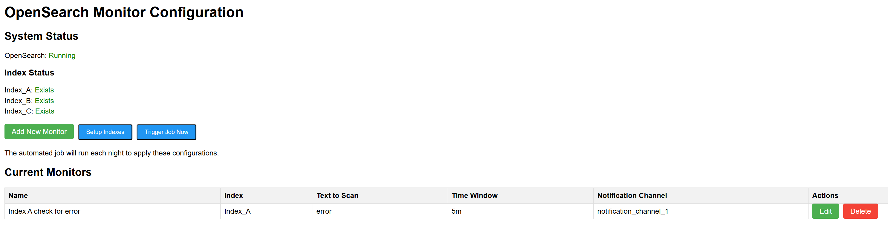
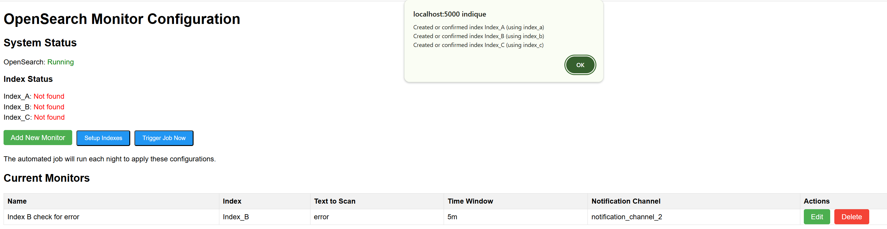
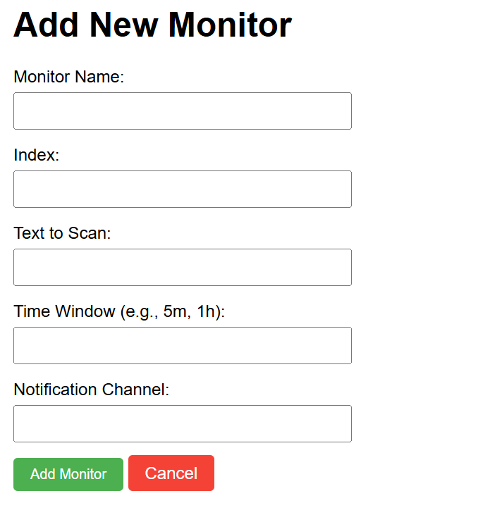
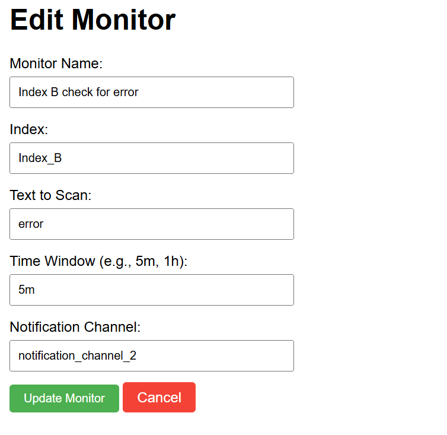
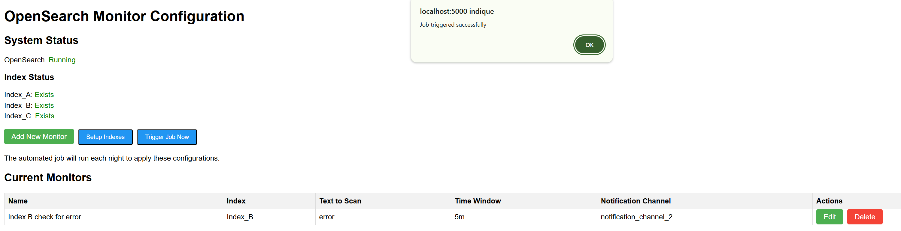
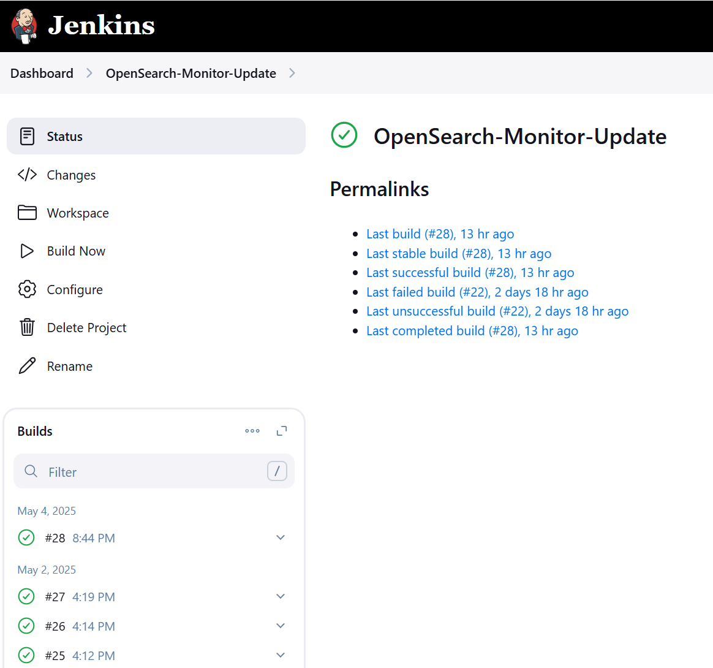
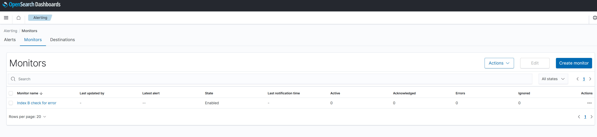

# OpenSearch Monitor Automation Solution

## Overview

This project provides a complete solution for managing OpenSearch monitors through a simple web interface and automated Jenkins jobs. It allows business users to easily create, update, and delete monitors with minimal effort by updating a single JSON file through a user-friendly interface.

## Architecture

The solution consists of four main components running in Docker containers:

1. **OpenSearch** - The core search and analytics engine with three indexes (index_a, index_b, index_c)
2. **OpenSearch Dashboards** - Web UI for OpenSearch, providing visualization and monitoring capabilities
3. **Jenkins** - Automation server for scheduling and running the monitor update job
4. **Monitor UI** - Custom web interface for business users to manage monitor configurations

```
┌─────────────────────────────────────────────────────────────────────────┐
│                                                                         │
│                      OPENSEARCH MONITOR AUTOMATION                      │
│                                                                         │
└─────────────────────────────────────────────────────────────────────────┘
                                    │
                                    ▼
┌─────────────────────────────────────────────────────────────────────────┐
│                                                                         │
│                         DOCKER CONTAINER ENVIRONMENT                    │
│                                                                         │
├─────────────────┬─────────────────┬─────────────────┬─────────────────┤
│                 │                 │                 │                 │
│   ┌─────────┐   │   ┌─────────┐   │   ┌─────────┐   │   ┌─────────┐   │
│   │         │   │   │         │   │   │         │   │   │         │   │
│   │ MONITOR │   │   │ JENKINS │   │   │OPENSEARCH│   │   │OPENSEARCH│   │
│   │   UI    │◄──┼───┤         │   │   │         │   │   │DASHBOARDS│   │
│   │PORT:5000│   │   │PORT:8080│   │   │PORT:9200│   │   │PORT:5601 │   │
│   │         │   │   │         │   │   │         │   │   │         │   │
│   └────┬────┘   │   └────┬────┘   │   └────┬────┘   │   └────┬────┘   │
│        │        │        │        │        │        │        │        │
└────────┼────────┴────────┼────────┴────────┼────────┴────────┼────────┘
         │                 │                 │                 │
         │                 │                 │                 │
         ▼                 │                 │                 ▼
┌────────────────┐         │                 │         ┌────────────────┐
│                │         │                 │         │                │
│  Business User │         │                 │         │ IT/Operations  │
│   Interface    │         │                 │         │    Interface   │
│                │         │                 │         │                │
└────────┬───────┘         │                 │         └────────────────┘
         │                 │                 │
         │                 │                 │
         │     ┌───────────▼─────────┐       │
         │     │                     │       │
         └────►│       Monitors      │◄──────┘
               │    Configuration    │
               │    (JSON File)      │
               │                     │
               └─────────────────────┘

┌─────────────────────────────────────────────────────────────────────────┐
│                                                                         │
│                           DATA & WORKFLOW                               │
│                                                                         │
├─────────────────────────────────────────────────────────────────────────┤
│                                                                         │
│  1. Business users manage monitors through the web UI (port 5000)       │
│                                                                         │
│  2. Changes are saved to the monitors.json configuration file           │
│                                                                         │
│  3. "Trigger Job Now" button or scheduled Jenkins job applies changes   │
│                                                                         │
│  4. Jenkins executes the update_monitors.sh script                      │
│                                                                         │
│  5. Script creates/updates monitors in OpenSearch via API               │
│                                                                         │
│  6. OpenSearch processes monitors, checking indexes for matching data   │
│                                                                         │
│  7. Results can be viewed in OpenSearch Dashboards                      │
│                                                                         │
└─────────────────────────────────────────────────────────────────────────┘
```

All components communicate via a shared Docker network, and persistent data is stored in Docker volumes.

## Directory Structure
- `docker-compose.yml` - Container orchestration configuration
- `monitor-ui/` - Web interface for business users
  - `Dockerfile` - Container definition
  - `app.py` - Flask application
  - `requirements.txt` - Python dependencies
  - `templates/` - HTML templates
- `config/` - Configuration files
  - `monitors.json` - Monitor configuration
  - `update_monitors.sh` - Script for monitor management

## Prerequisites

- Ubuntu running on Windows via WSL
- Docker and Docker Compose
- Web browser

## Step-by-Step Setup Instructions

### 1. Set Up Docker in Ubuntu WSL

Install Docker and Docker Compose on your Ubuntu WSL system. This involves adding Docker's repository, installing the necessary packages, and setting up the Docker service.

See [Docker installation commands](https://docs.docker.com/engine/install/ubuntu/) for the detailed installation process.

### 2. Create Project Structure

```bash
# Create project directory
mkdir -p ~/opensearch-test
cd ~/opensearch-test

# Create directories for our components
mkdir -p monitor-ui/templates config
```

### 3. Create Docker Compose Configuration

Create the `docker-compose.yml` file in the project root directory. This file defines the container setup for OpenSearch, OpenSearch Dashboards, Jenkins, and our custom Monitor UI application.

See [docker-compose.yml](opensearch-test/docker-compose.yml) for the configuration.

### 4. Create Monitor UI Files

Create the following files for the Monitor UI component:

- [Dockerfile](opensearch-test/monitor-ui/Dockerfile) - Container definition for the Monitor UI
- [requirements.txt](opensearch-test/monitor-ui/requirements.txt) - Python dependencies
- [app.py](opensearch-test/monitor-ui/app.py) - Flask application that provides the web interface

The application also creates HTML templates when first run:
- `templates/index.html` - Main dashboard view
- `templates/add.html` - Form for adding monitors
- `templates/edit.html` - Form for editing existing monitors

### 5. Create the Monitoring Script

Create the [update_monitors.sh](opensearch-test/config/update_monitors.sh) script in the config directory. This script is responsible for reading the monitor configurations from the JSON file and creating/updating monitors in OpenSearch.

Make the script executable:
```bash
chmod +x config/update_monitors.sh
```

### 6. Create Initial Monitors JSON File

Create the [monitors.json](opensearch-test/config/monitors.json) file in the config directory with the initial monitor configurations.

### 7. Build and Start the Environment

```bash
# Build and start the containers
docker-compose up -d

# Wait for services to start (it might take a minute or two)
echo "Waiting for services to start..."
sleep 30
```

### 8. Set Up Jenkins

1. Get the initial admin password:

```bash
docker exec jenkins cat /var/jenkins_home/secrets/initialAdminPassword
```

2. Open Jenkins in your browser: http://localhost:8080
3. Complete the setup wizard:
   - Enter the admin password from the previous step
   - Select "Install suggested plugins"
   - Create an admin user when prompted
   - Use the default Jenkins URL

4. Create a Jenkins job:
   - Click "New Item" in the Jenkins dashboard
   - Enter "OpenSearch-Monitor-Update" for the name and select "Freestyle project"
   - Click "OK"
   - In the "Build Triggers" section, check "Build periodically" and enter `0 0 * * *` (runs at midnight)
   - In the "Build" section, click "Add build step" and select "Execute shell"
   - Enter the following shell command:
   ```
   bash /config/update_monitors.sh
   ```
   - Click "Save"

## Usage

### Testing the Solution

1. Access the Monitor UI at http://localhost:5000
2. Click the "Setup Indexes" button to create the three required OpenSearch indexes
3. View the current monitors from the initial JSON file
4. Try adding a new monitor using the "Add New Monitor" button
5. Trigger the Jenkins job manually by clicking the "Trigger Job Now" button
6. Verify that the monitors have been created in OpenSearch by accessing OpenSearch Dashboards at http://localhost:5601 and navigating to the Alerting section

### For Business Users

1. Access the web interface at http://localhost:5000
2. Add, edit, or delete monitors as needed through the UI
3. Changes are automatically saved to the configuration file
4. The Jenkins job will run nightly at midnight to apply changes to OpenSearch

I'll help you add a demo and screenshot section to your README file. This will enhance the documentation by providing visual context for users who want to understand how your OpenSearch Monitor Automation Solution works in practice.

Here's a section you can add to your README file:

## Demo and Screenshots

The following screenshots showcase the complete workflow of the OpenSearch Monitor Automation Solution, demonstrating how business users can easily manage OpenSearch monitors through a user-friendly interface without needing technical expertise.

### Monitor UI WebApp

*Screenshot showing the main dashboard of the Monitor UI with the list of current monitors, the "Setup Indexes" button, and the "Add New Monitor" button.*


*The index creation process is simplified through the UI. With a single click, users can create all necessary OpenSearch indexes required for the monitors to function properly. This eliminates the need for direct API access to OpenSearch.*

### Adding a New Monitor

*The "Add New Monitor" functionality allows business users to create new monitors with a simple form interface. All monitor parameters can be configured without writing JSON manually.*

### Editing an Existing Monitor

*Existing monitors can be easily modified through the edit interface. All current settings are pre-populated in the form for easy updating.*

### Immediate Deployment Option

*The "Trigger Job Now" button provides instant deployment capability for monitor configurations. When business users make changes to monitors, they don't need to wait for the scheduled nightly Jenkins job to apply their configurations. Instead, they can click this button to immediately execute the update_monitors.sh script*

### Jenkins Build History

*The solution uses Jenkins as the automation server to handle the scheduled updates of monitors. A Jenkins job runs the update_monitors.sh script, which reads the monitor configurations from the JSON file and applies them to OpenSearch.*

### OpenSearch Dashboards Alerting

*After the monitor configurations are applied, users can verify the results in OpenSearch Dashboards by navigating to the Alerting section.*


## Troubleshooting

### Docker Not Running

If you encounter an error like "Cannot connect to the Docker daemon", ensure Docker is running:

```bash
sudo service docker status
sudo service docker start
```

### Flask Application Errors

If the Monitor UI shows an internal server error, check the logs:

```bash
docker logs monitor-ui
```

Common issues and fixes:

1. **'enumerate' is undefined**: Add `app.jinja_env.globals.update(enumerate=enumerate)` to your Flask app
2. **Incompatible Flask/Werkzeug versions**: Use compatible versions in requirements.txt (flask==2.0.1, werkzeug==2.0.3)

### OpenSearch Index Creation Errors

If index creation fails with errors like "invalid_index_name_exception", use lowercase index names:

```bash
# OpenSearch requires lowercase index names
# Use a mapping between display names and actual index names
INDEX_MAPPING = {
    "Index_A": "index_a",
    "Index_B": "index_b",
    "Index_C": "index_c"
}
```

## Assumptions

1. **OpenSearch Setup**: 
   - A single-node OpenSearch cluster is sufficient for this test
   - Security plugins are disabled for simplicity (would be enabled in production)
   - Three indexes (Index_A, Index_B, Index_C) are required as specified

2. **Monitor Configuration**:
   - Monitor configuration is stored in a JSON file with the structure provided in the test
   - Business users require a simple way to edit this configuration
   - The JSON structure remains consistent with the example provided

3. **Automation Requirements**:
   - Jenkins is used for scheduling and running the automation
   - The automation script runs nightly at midnight
   - The automation script handles both creation of new monitors and updates to existing ones

4. **User Interface**:
   - Business users prefer a simple web interface over manually editing JSON files
   - The web interface should provide basic validation and error handling
   - The interface should show the current status of the system

5. **Docker Environment**:
   - Docker is used to simplify deployment and ensure consistency
   - All components can run in containers
   - Volumes are used for persistent storage of data and configurations

6. **Security Considerations**:
   - This is a test environment, so security is minimal
   - In production, we need to implement proper authentication, HTTPS, and secure secrets management